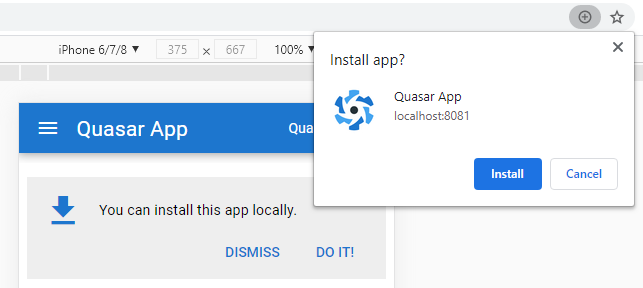

Quasar PWA Installer
===

PWA installer is a [Quasar App Extension](https://quasar.dev/app-extensions/introduction) aimed at PWA developers looking to create a customized install experience for their app, for example a banner with an Install button:



**NOTE:** As of December 2020 it's still not possible to trigger PWA install programatically on iOS Safari. See compatibility link below.

# Features

The extension registers a `pwa-installer` Vuex store module which allows you to hook into the PWA installation flow by exposing several states and a couple of methods.

## States

|Name|Type|Possible values|Description|
|---|---|---|---|
|`displayMode`|String|`browser tab`<br>`standalone`<br>`standalone-ios`||
|`event`|[BeforeInstallPromptEvent](https://developer.mozilla.org/en-US/docs/Web/API/BeforeInstallPromptEvent)||The captured `beforeinstallprompt` event which will be fired when the user triggers your custom install prompt.|
|`userChoiceOutcome`|String|`accepted`<br>`dismissed`|A reference to the outcome of the captured event ([`BeforeInstallPromptEvent.userChoice.outcome`](https://developer.mozilla.org/en-US/docs/Web/API/BeforeInstallPromptEvent#Properties))|
|`isCustomPromptDismissed`|Boolean||Allows you to track whether the user dismissed your custom UI.|

## Methods

|Name|Description|
|---|---|
|`prompt`|Triggers the native install prompt.|
|`dismissCustomPrompt`|Hides your custom install UI.|

# Install

```bash
quasar ext add pwa-installer
```
Quasar CLI will retrieve it from the NPM registry and install the extension to your project.

# Uninstall

```bash
quasar ext remove pwa-installer
```

# Useful links

* https://web.dev/customize-install/
* https://developer.mozilla.org/en-US/docs/Web/API/BeforeInstallPromptEvent
* [BeforeInstallPromptEvent.prompt()](https://caniuse.com/mdn-api_beforeinstallpromptevent_prompt) browser support

# Support

Feel free to contribute pull requests and ideas or open an issue, I'll do my best to look at it in the same century.
